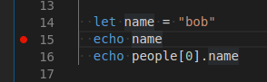
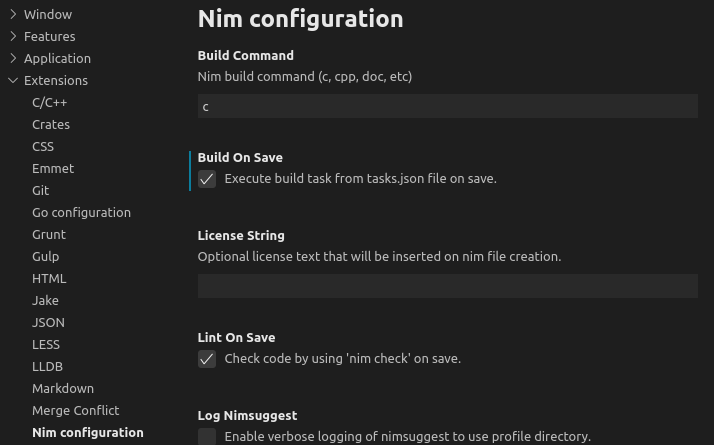
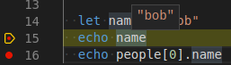

# How to debug Nim code in VSCode

Below are some steps to help you debug [Nim](https://nim-lang.org/) code in [Visual Studio Code](https://code.visualstudio.com/).

## Prerequisites

1. Nim is installed.
2. GDB is installed.
3. VSCode is installed.
4. The [Nim VSCode extension](https://marketplace.visualstudio.com/items?itemName=kosz78.nim) is installed.
5. The [Native Debug VSCode extension](https://marketplace.visualstudio.com/items?itemName=webfreak.debug) is installed.
6. This example repository has been cloned with [Git](https://git-scm.com/).

## Steps to setup debugging

This repository contains some files to help setup debugging in VSCode.

1. Open VSCode.
2. File -> Open Folder -> Open the cloned repository folder in VSCode.
3. Open `main.nim`.
4. Set a breakpoint on line 15 in the file:



5. Build the code (ctrl-shift-b), which should use the build definition in `.vscode/tasks.json`.
My preference is to set "Build on Save" in the VSCode-Nim configuration:



5. Debug -> Start Debugging, which should use the launch config in `.vscode/launch.json`.
6. Once the breakpoint is hit, let's enable pretty-printing. Otherwise, when you mouse over a
symbol in the debugger, you'll see memory addresses instead of values.

Open the Debug Console (at the bottom) and type:

```
python exec(open("bin/nim-gdb.py").read())
```

Note: The `nim-gdb.py` script was copied from [here](https://github.com/nim-lang/Nim/blob/master/tools/nim-gdb.py),
and exists in the `bin/` directory simply to reduce the number of steps in setting this up.

If running the Python pretty-printing script succeeds, you should be able to mouse over a variable,
e.g. a string, and see the value:



You'll notice, however, if you mouseover `people[0].name`, that it does not show the name of the first person
(perhaps the `nim3.py` script could be modified to support this).

## Notes

GDB can be extended with Python, and the [nim-gdb.py](https://github.com/nim-lang/Nim/blob/master/tools/nim-gdb.py) script
can be used from the command-line using [this bash script](https://github.com/nim-lang/Nim/blob/devel/bin/nim-gdb).

The [nim-gdb repository](https://github.com/cooldome/Nim-gdb) seems to be the predecessor to the nim-gdb script
in the official Nim repository.

## References

[Debug Nim with GDB](https://internet-of-tomohiro.netlify.com/nim/gdb.en.html)  
[Nim GDB video](https://www.youtube.com/watch?v=DmYOPkI_LzU)  
[Nim Editor Support](https://github.com/nim-lang/Nim/wiki/Editor-Support)  
[repr method for debugging](https://nim-lang.org/docs/system.html#repr%2CT)  
[Nim VSCode plugin debug feature request](https://github.com/pragmagic/vscode-nim/issues/65)  
[Extending GDB using Python](https://sourceware.org/gdb/onlinedocs/gdb/Python.html#Python)  